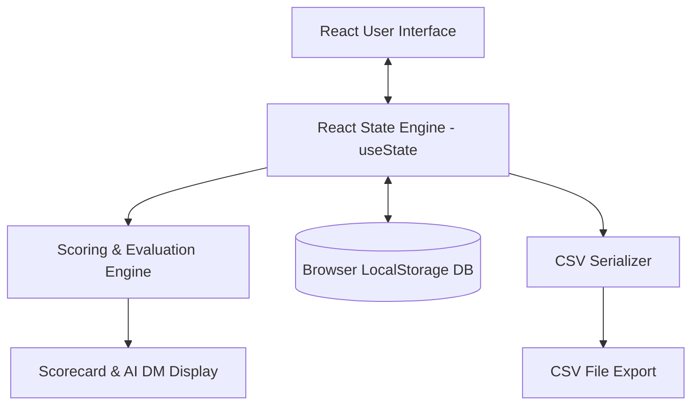
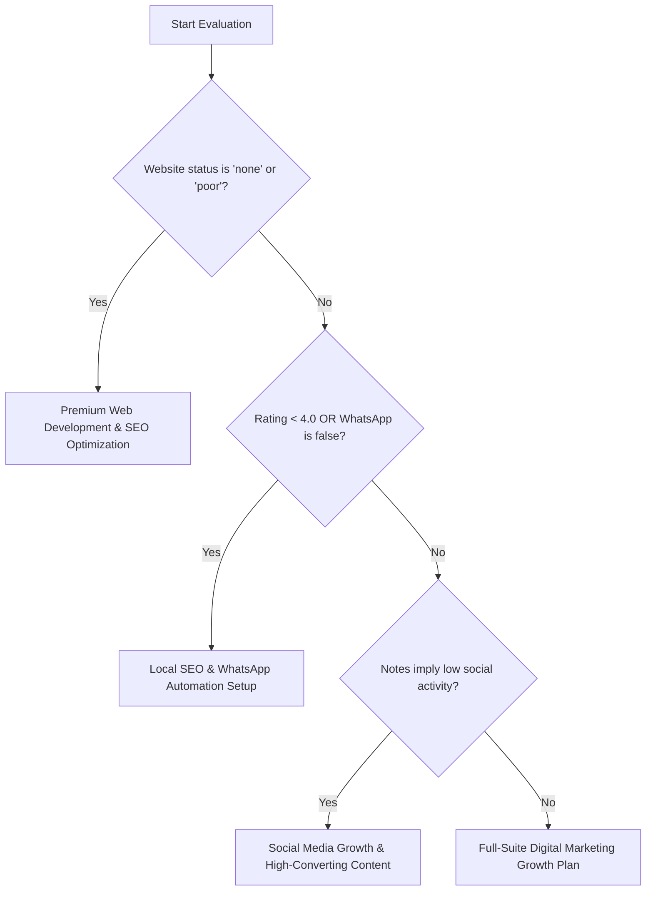

# Technical Architecture & Specification: B Socio AI Lead Scoring Engine

This document provides a comprehensive technical overview of the B Socio AI Lead Scoring Dashboard. You can use this specification to explain the architecture, stack decisions, business logic, and data flow to your company.

---

## 1. High-Level System Architecture

The application is built as a client-side **Single-Page Application (SPA)**. It operates entirely on the user's device (the browser), requiring no database or backend servers to function.

### Architectural Diagram


### Key Architectural Benefits
- **Zero Operating Costs**: Because it hosts as static assets (HTML/JS/CSS), it can be deployed on free services (Vercel, Netlify, GitHub Pages) without any monthly server bills.
- **Data Privacy**: Leads are stored locally in the browser's storage space (`localStorage`). Sensitive prospect data never leaves the user's computer.
- **Instant Response (Sub-millisecond latency)**: Calculations are performed on the fly as characters are typed, bypassing the latency of backend server round-trips.

---

## 2. Technology Stack & Rationale

We selected a modern, light, and robust frontend stack. Here is the decision matrix behind the choices:

| Technology | Role | Why We Selected It |
| :--- | :--- | :--- |
| **Vite** | Build Tool & Bundler | Replaced old setups (like Create React App) with a super-fast build pipeline. It uses native ES modules to boot the development server instantly and compiles production code with high efficiency. |
| **React (v18)** | Frontend Framework | Enables a component-based model. Its virtual DOM and state trackers (`useState`, `useEffect`) manage inputs and dynamically recalculate ratings in real-time as users modify values. |
| **Tailwind CSS (v3)** | Utility CSS Framework | Allows us to style components inside markup using speed classes. Tailwind's build system strips unused CSS to deliver lightweight bundles, and makes responsive design simple via prefixes (e.g. `md:`, `lg:`). |
| **Lucide React** | Icon Suite | High-quality, scalable SVG icons that load on-demand. Ensures crisp rendering on high-DPI retina screens and mobile devices. |
| **LocalStorage** | Database Layer | Client-side key-value database provided by the browser. It persists prospect logs directly to the user's hard drive so that data remains safe through computer reboots or tab refreshes. |

---

## 3. Data Model Schema

Every lead logged within the system conforms to the following strict JavaScript Object Schema:

```typescript
interface Lead {
  id: string;                    // Unique identifier (timestamp prefix 'lead-xxx')
  businessName: string;          // Name of the prospect business (required)
  category: string;              // Dropdown: Cafe, Gym, Retail, Real Estate, E-commerce, Local Service
  city: string;                  // Physical location of the business (required)
  instagramLink?: string;        // Optional Instagram URL
  websiteStatus: 'none' | 'poor' | 'good'; // Audited website state
  googleRating: number;          // Float slider: 1.0 to 5.0
  isWhatsAppAvailable: boolean;  // Toggle indicator
  notes?: string;                // Detailed audit observations text
  score: number;                 // Evaluated score (0 to 100)
  priority: 'Hot' | 'Warm' | 'Cold'; // Status badge category
  recommendedService: string;    // Product offering recommended for pitch
  generatedDM: string;           // Custom direct outreach message string
}
```

---

## 4. Scoring Logic & Decision Engine

The dashboard's core value lies in its evaluation engine. When inputs change or a form is submitted, the utility function processes scores using the following criteria:

### A. Score Calculation Model (Max 100 Points)
Points are awarded based on **opportunities for B Socio to sell a service** (higher points indicate a worse online presence, meaning a higher sales priority):

1. **Website Status (Max 30 pts)**:
   - `none` (No Website): **+30 pts** (massive gap)
   - `poor` (Outdated Website): **+15 pts** (needs redevelopment)
   - `good` (Modern Website): **+0 pts** (no immediate work)
2. **Google Rating (Max 25 pts)**:
   - Rating < 4.0: **+25 pts** (needs reputation management)
   - 4.0 to 4.5: **+10 pts** (has room for optimization)
   - Rating > 4.5: **+0 pts** (healthy status)
3. **WhatsApp Setup (Max 20 pts)**:
   - `false` (Not Connected): **+20 pts** (opportunity to sell chat automation)
   - `true` (Active Support): **+5 pts** (retains default engagement points)
4. **Social Media Audits (Max 25 pts)**:
   - Scanning the observations note: If it contains terms like *inactive, no posts, slow, missing, quiet* (or checked): **+25 pts** (needs content management)
   - Else: **+5 pts** (default starting score)

### B. Priority Assignment
- **Score >= 75**: `Hot` ➔ Highly vulnerable target. Extremely high potential to close. Highlighted with a pulse animated red/orange badge.
- **Score 45 - 74**: `Warm` ➔ Moderate flaws. Worth nurturing. Amber yellow badge.
- **Score < 45**: `Cold` ➔ Strong online presence. Low immediate sales leverage. Slate blue badge.

### C. Recommended Service Pitch Matrix
The algorithm matches the customer's largest digital gap with B Socio's core offerings using this logic:



---

## 5. Detailed User Workflow Lifecycle

1. **The Live-Preview Loop**:
   - As a sales representative audits a prospect, they start filling in details on the left form.
   - The input controls capture data instantly via React bindings.
   - Rather than waiting for submission, the app triggers `calculateLeadMetrics` in real-time, updating the SVG circular gauge, priority tags, and custom DM box on the right.
2. **The Commit & Persistence Action**:
   - The user clicks **Evaluate & Log Lead**.
   - The React app validates inputs, locks the final metrics calculation, assigns a timestamp ID, and prepends the new object to the `leads` state array.
   - This state change triggers `useEffect` which serializes the array to JSON and writes it to browser `localStorage`.
   - The form clears, ready for the next audit.
3. **The Outreach Phase**:
   - The user selects a lead from the history log. The details are loaded into the scorecard view.
   - The user clicks **Copy Message**, which calls the clipboard API. They paste the personalized DM directly into Instagram, Email, or WhatsApp.
4. **Data Admin Operations**:
   - **Search & Filters**: Users search records by name/city or filter by category to locate targets.
   - **CSV Export**: The system maps the array objects to a comma-separated format, wraps it in a data blob, and triggers a local file download.

---

## 6. How B Socio Can Host/Deploy This Project

Since this React/Vite app is compiled into simple static HTML/JS/CSS assets (via `npm run build`), you have three easy deployment paths:

1. **Vercel or Netlify (Recommended)**:
   - Link your Git repository (e.g. GitHub) to Netlify or Vercel.
   - Set build command to `npm run build` and output folder to `dist`.
   - The hosting service will deploy it globally on a CDN and rebuild it automatically every time you push code updates.
2. **GitHub Pages (Free)**:
   - Use a simple GitHub Action to build and deploy the `dist` folder to a `gh-pages` branch.
3. **Internal Server Hosting**:
   - Compile the static assets locally using `npm run build`.
   - Drag and drop the resulting `dist` folder directly onto any cPanel, Apache, Nginx, or AWS S3 bucket.
